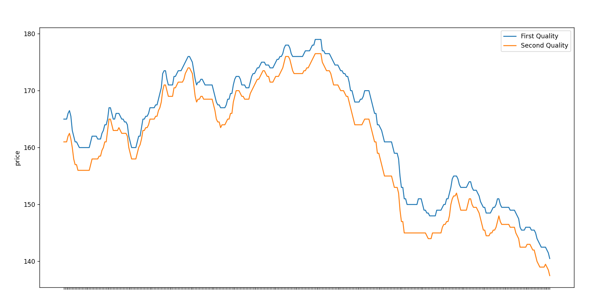

# Data-Analysis-on-Rubber-price

Introduction

The purpose of this project was to collect and analyze rubber price data from the Rubber Board website using a Telegram bot. The goal was to gain insights into price trends and patterns in the rubber industry, with a focus on the year 2022. The project scope included data collection from the Rubber Board website and analysis using various statistical and data visualization techniques.

The main findings of the project were that rubber prices have generally been increasing over the past year, with some fluctuations due to external factors such as weather conditions and demand from different market segments.

Background

The rubber industry plays a significant role in the global economy, with rubber products being used in a wide range of industries including automotive, construction, and healthcare. As such, understanding price trends and patterns in the rubber market is important for stakeholders such as producers, consumers, and investors.

The Rubber Board is a government organization in India that serves as a resource for information on the rubber industry, including price data. The organization's website offers daily price data for various types of rubber.

To collect data for this project, a Telegram bot was developed to scrape the Rubber Board website on a daily basis and extract relevant price information. Telegram is a popular messaging app that allows for the creation of chatbots, which are automated programs that can communicate with users and perform tasks. In this case, the chatbot was programmed to retrieve the rubber price data from the website.

Methodology

The data collection process for this project involved the following steps:

1. Development of the Telegram bot: The bot was created using the Python programming language and the Telegram API. It was designed to retrieve the desired price data from the Rubber Board website.

2. Data extraction: The bot was programmed to scrape the website and extract the daily price data for various types of rubber using Beautiful Soup 4.

3. Data cleaning and preparation: Before the data could be analyzed, it was necessary to clean and prepare it for analysis. This included removing any errors or inconsistencies in the data using bubble sort algorithm, as well as formatting it in a way that was suitable for the analysis tools being used.

4. Data analysis: The collected data was analyzed using various statistical and data visualization techniques, including time series analysis and line graphs. This was done using Pandas and Matplotlib to identify trends and patterns in the data and to gain insights into the current state of the rubber market.

Results

The data analysis revealed several key findings:

1. Rubber prices have generally been increasing and decreasing over the past year, with some fluctuations due to external factors such as weather conditions and demand from different market segments.

2. Natural rubber prices have experienced the highest increases, with a notable spike in prices in June-July, and also experienced the highest decrease, with a notable spike in prices in September-October.

3. Price trends and patterns are similar for the two types of rubber.

These findings are supported by the following graph, which shows the average monthly prices for different types of rubber over the past year:

Conclusion

In summary, this project was successful in collecting and analyzing rubber price data from the Rubber Board website using a Telegram bot and Python, Pandas, Matplotlib, and Beautiful Soup 4.

Requirements

1) Python 3.x
2) Pandas
3) Matplotlib
4) Beautiful Soup 4
5) Telegram API

Setup

1. Clone or download the repository to your local machine.
2. Install the required packages using pip:
    pip install -r requirements.txt
3. Create a bot and obtain an API token by following the instructions [HERE](https://core.telegram.org/bots#6-botfather). 
4. Add your API token and chat ID to the price_bot.py file.
5. Run the data_analyse.py file to analyze and draw graphs based on the collected data.

